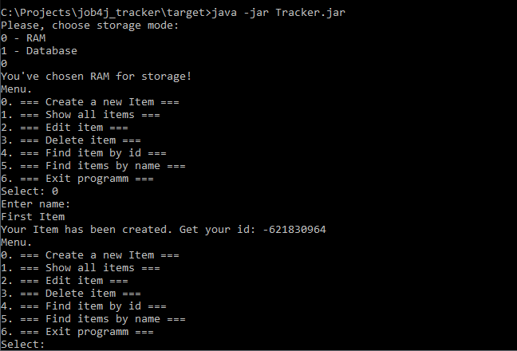
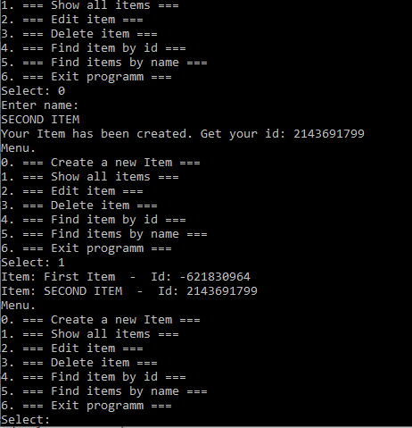
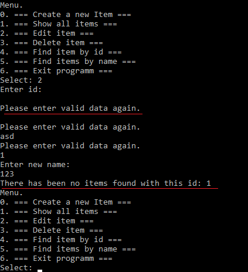
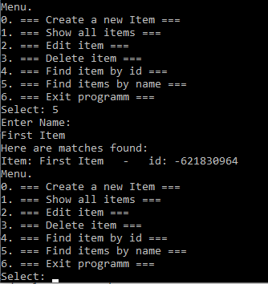
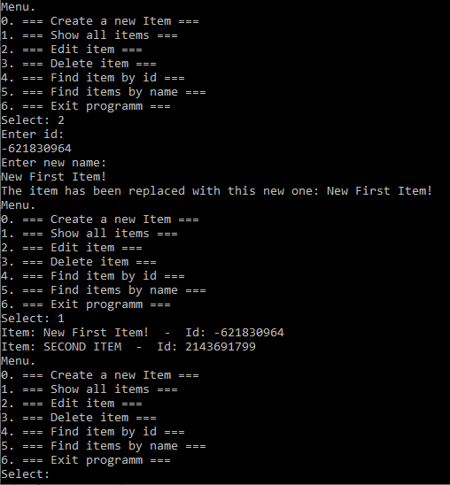
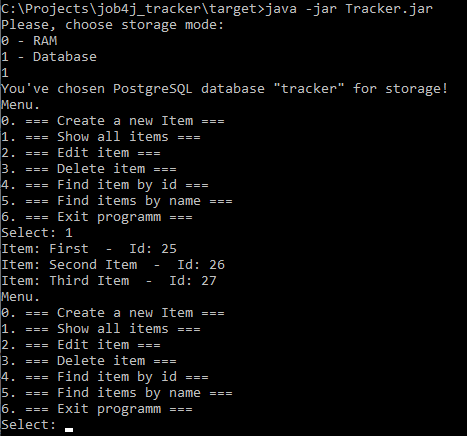

# Tracker

This is a simple console application called "Tracker".

### Functionality
- Creating a string-valued item with the assigned id;
- Storing data in RAM or database;
- Editing or deleting an item;
- Validation against irrelevant input;

### Technologies used
- Simple architecture based upon OOP principles;
- PostgreSQL database for storing data;
- Liquibase for integration testing;

### Demonstration

First, choose the way to store data. 
Then, you can create a new Item inputting the corresponding menu point.

Show all items.

Validation when trying to input irrelevant option.

Finding the item by its name.

Successful editing of the existing item.

The database storage option. 

